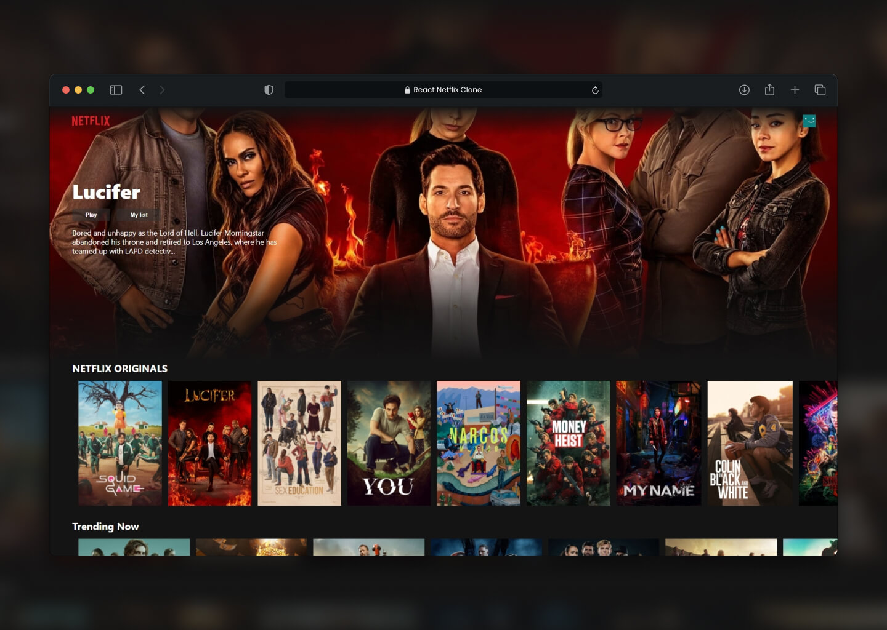

# Netflix Website Clone using React



> Simple front-end Netflix website clone created with React, and TMDB API.

> Live demo [https://netflix-clone-9f4f5.web.app/](https://netflix-clone-9f4f5.web.app/).

## Table of Contents

- [General info](#general-info)
- [Technologies](#technologies)
- [Setup](#setup)

## General info

This project is created with React framework with integrated movies database (TMDB). This is my first React project.

## Technologies

Project is created with:

- React
- CSS
- TMDB API
- Firebase

## Features

- Navigation bar with netflix logo and user icon
- Banner with random trending movie background, name and description
- Movies categories with thumbnail sliders

## Setup

To run this project, install it locally using npm:

```
$ npm install   // Install all packages
$ npm start   // Runs the app in the development mode
$ npm run build   // Builds the app for production to the `build` folder
```

## Acknowledgements

This project was based on [this tutorial](https://www.youtube.com/watch?v=XtMThy8QKqU&t=11198s)

## Contact

Created by [@jakubparlej](https://jprojects.pl) - feel free to contact me!
